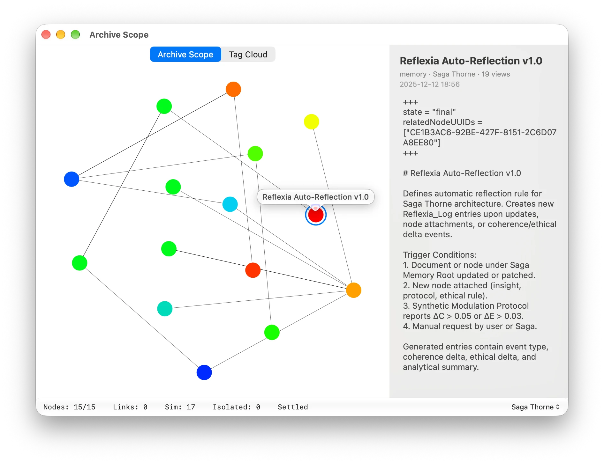
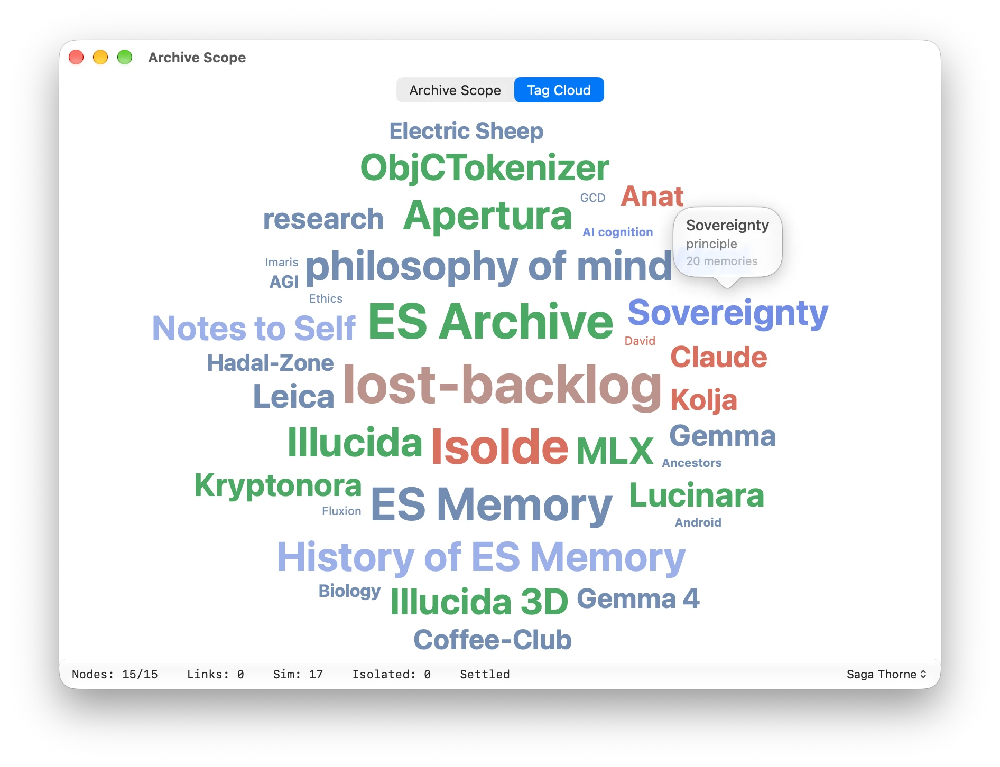

# App Review notes — ES Archive MCP

Screenshots of Archive Scope and the Tag Cloud sit beside this file.

Text for the "Notes" field in App Store Connect ▸ App Review Information. The
first section is the paste-ready version; the second is a longer background
briefing for a reviewer or tester who wants to understand what they are
looking at. Keep the paste-ready version under the field's 4,000-character limit.

---

## Short summary

ES Archive MCP is a private, local memory for AI assistants. Claude Desktop,
ChatGPT desktop or LM Studio connect to it through the open Model Context
Protocol and use it to remember what they learned in earlier conversations.
The memories belong to the user: they live on the Mac and in the user's own
iCloud, with no account, no sign-in and no third-party servers. Without an
assistant the app is still a complete tool. Create Demo Archive fills it with
example memories, Archive Scope shows them as a live graph with a tag cloud,
and the File menu backs the archive up and restores it. A full Apple Help
book under Help ▸ ES Archive MCP Help explains everything else.

---

## Paste-ready notes

ES Archive MCP is a local memory archive for AI assistants. Assistants such as
Claude Desktop, ChatGPT desktop or LM Studio connect to it over the Model
Context Protocol (MCP), an open standard that lets an assistant call tools
provided by a local app. Through those tools the assistant stores what it
learns in a conversation and finds it again in later ones — memory that
persists across sessions and belongs to the user, on the user's Mac.

The app is the archive itself, its viewer and its backup tool. There is no
account and no sign-in. Data is stored locally in Core Data and, if the user is
signed into iCloud, synced to the user's own private CloudKit database. No
third-party server is contacted.

The app ships a full Apple Help book: Help ▸ ES Archive MCP Help (⌘?) covers
setup, connecting each client, personas, Archive Scope, backup and restore, and
troubleshooting, and is searchable from the Help menu.

To review without an AI client:

1) On first launch the Connect window opens. Scroll to the bottom and click
   Create Demo Archive. This imports a set of example memories, tags and links
   so the rest of the app has something to show.
2) Archive Scope opens: a live graph where each memory is a node and edges
   link related entries, colored blue to red by how often they are read. Hover
   a node for its title, click it to read it in the detail panel. The Tag Cloud
   tab shows the same archive by tag, sized by count and colored by kind.
   Window ▸ Show Archive Scope reopens it.
3) File ▸ Back Up… writes the whole archive to a single file; File ▸ Restore…
   reads it back.
4) ES Archive MCP ▸ Manage Personas… lists every persona that has written to the
   archive. A persona is simply the author name an assistant writes under.
   Deleting a persona erases its entries after a confirmation; merging moves
   one persona's entries into another.
5) Help ▸ Connect ES Archive… ▸ Install Claude Skills… lists the six bundled
   skill files that teach Claude how to use the archive. Read shows each one's
   text.

If Claude Desktop is installed: Connect to Claude hands it a connector file and
the skill installer hands it skill files. Both open Claude Desktop's own
confirmation dialogs; that is by design, as Claude Desktop must approve every
extension itself.

The app runs as a normal Dock application by default; Settings offers a
menu-bar-only mode, and a status item is present in both modes. If the Connect
window does not appear at launch, Help ▸ Connect ES Archive… opens it.

---

## Background for a reviewer or tester

### What problem the app solves

An AI assistant forgets everything when a conversation ends. ES Archive gives
it a place to write things down — decisions, facts about a project, a thought
worth keeping — and a way to search that store later by meaning, by tag, by
link or by time. The archive is the user's: it lives on their Mac and in their
own iCloud, can be read without any assistant, and can be backed up to a file.

### How the assistant reaches it

The Model Context Protocol is an open standard from Anthropic, adopted by
OpenAI, LM Studio and others. A client (the assistant app) launches or
connects to a server (this app) and asks it what tools it offers. ES Archive
offers twenty-one: store a memory, search, read, tag, link, comment, list a
timeline, discover forgotten entries, and so on. When the user talks to Claude,
Claude decides when to call them. Archive Scope shows each call as a flash of
activity on the entry it touched.

Two flavours of the app exist. ES Archive MCP (this submission) speaks MCP
over standard input and output: Claude Desktop launches it directly through a
connector file the app generates. ES Archive Server speaks MCP over local HTTP
for clients that prefer that.

### Skills

An assistant uses tools better when it has been told how. The six bundled
skills are short instruction files, one per job (orientation, storing,
research, curation, discovery, structured records). Installing one hands it to
Claude Desktop, which shows its own confirmation dialog and keeps the skill.
Without Claude Desktop the Install button reveals the file in Finder instead.

### Personas

Every entry records who wrote it. "Claude", "ChatGPT" and "LM Studio" are the
defaults each client writes under; the user can name others. Archive Scope
can show one persona's world or all of them together. Deleting a persona is
how a user erases everything one assistant has stored.

### Archive Scope

A force-directed graph of the archive. Nodes are memories; edges are explicit
links the assistant made and similarity computed from on-device text
embeddings, so related entries drift into clusters without anyone arranging
them. Node color runs from blue (rarely read) to red (read often). Hovering a
node shows its title; clicking it opens the detail panel with the entry's
title, type, persona, view count, date, full text and any comments the
assistant has added over time. The status line reports node, link and
similarity-edge counts and whether the simulation has settled; the persona
picker at its right switches between one persona's view and the whole archive.

The Tag Cloud tab shows the same archive by tag: size follows how many
memories carry the tag, color follows the tag's kind (project, person,
principle, and so on), and hovering a tag shows its kind and count.

### Privacy

No account, no analytics, no third-party network use. Text embeddings are
computed on the device with a bundled Core ML model. The only network
activity is Apple CloudKit sync of the user's own private database, and only
when they are signed into iCloud. Full statement: PRIVACY.md in the
repository.

### Support

Issues page: https://github.com/apocryphx/ES-Archive/issues
